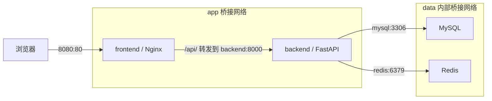

# 掘金头条项目

## Docker 部署

需要 Docker Desktop（Linux 容器）或 Docker Engine，以及 Compose v2。
首次部署复制 `.env.example` 为 `.env`，设置两个不同的随机数据库密码。本机已生成 `.env`，无需覆盖。

```powershell
docker compose build
docker compose up -d --wait
```

访问 http://localhost:8080 ，其他设备使用 `http://服务器IP:8080`。端口通过 `.env` 的 `WEB_PORT` 修改。

本机 Docker Hub 认证连接超时，已改用 AWS Public ECR 中的 Docker 官方镜像进行构建。
遇到同样网络问题时，可运行：

```powershell
docker compose build --build-arg PYTHON_IMAGE=public.ecr.aws/docker/library/python:3.13-slim --build-arg NODE_IMAGE=public.ecr.aws/docker/library/node:22-alpine --build-arg NGINX_IMAGE=public.ecr.aws/docker/library/nginx:stable-alpine
docker pull public.ecr.aws/docker/library/mysql:8.4
docker tag public.ecr.aws/docker/library/mysql:8.4 mysql:8.4
docker pull public.ecr.aws/docker/library/redis:7.4-alpine
docker tag public.ecr.aws/docker/library/redis:7.4-alpine redis:7.4-alpine
docker compose up -d --no-build --wait
```

## 镜像与组网

| 服务 | 镜像 | 用途 |
| --- | --- | --- |
| frontend | local/diggoldtitle-frontend:dev | Node 多阶段构建 Vue，Nginx 提供静态文件及反向代理 |
| backend | local/diggoldtitle-backend:dev | Python 3.13 / FastAPI / Uvicorn，非 root 用户运行 |
| mysql | mysql:8.4 | 数据库，命名卷持久化 |
| redis | redis:7.4-alpine | 可重建的新闻缓存，限制内存 128 MB |



当前单机部署采用 Compose + 两个用户自定义 bridge 网络。
前端、后端加入 `app`；后端、MySQL、Redis 加入 `data`，其中 `data` 设置 `internal: true`。
只有 Nginx 映射宿主机端口，8000、3306、6379 不对外映射；前端容器不加入数据库网络。
浏览器通过同源 `/api` 访问后端，无需配置后端 IP 或跨域地址。
容器通过服务名发现彼此；Nginx 使用 Docker DNS 定期解析，支持后端容器重建后 IP 变化。
参见 [Docker Compose 网络文档](https://docs.docker.com/compose/how-tos/networking/)。

Compose 等待数据库和 Redis 健康后启动后端，再等待后端健康后启动前端。
后端健康检查验证 HTTP 进程；数据库和缓存分别有自己的健康检查。

## 数据与日常操作

首次创建空 MySQL 数据卷时，自动执行 `sql/database.sql`，导入表结构、示例新闻及原 SQL 中的测试用户。
不会迁移宿主机现有 MySQL 数据；需要现有业务数据时，另行备份并导入。
初始化完成后修改 SQL 文件不会自动更新已有数据库；修改 `.env` 密码也不会自动修改数据库内的账号密码。
Redis 仅保存缓存，不持久化，重启后按需重新生成。

```powershell
docker compose ps
docker compose logs --tail=100 backend
docker compose logs --tail=100 mysql
docker compose down
```

`docker compose down` 保留 MySQL 数据卷；`down -v` 会删除数据库数据，请勿作为日常停止命令。

重新构建并更新：

```powershell
docker compose up -d --build --wait
```

导出前后端镜像：

```powershell
docker image save -o diggoldtitle-images.tar local/diggoldtitle-frontend:dev local/diggoldtitle-backend:dev
# 目标机器导入后，复制 compose.yaml、sql/，并设置 .env
docker image load -i diggoldtitle-images.tar
docker compose up -d --no-build --wait
```

目标机器仍需拉取 MySQL、Redis 镜像。镜像架构取决于构建机器。

## 本地开发及 AI 配置

后端支持 `DATABASE_URL` 或 `MYSQL_HOST`、`MYSQL_PORT`、`MYSQL_DATABASE`、`MYSQL_USER`、`MYSQL_PASSWORD` 环境变量。
未设置时保留原本的本机数据库默认值；Redis 支持 `REDIS_HOST`、`REDIS_PORT`、`REDIS_DB`。
容器中已通过 Compose 设置相应服务名。
前端默认同源请求，`npm run dev` 通过 Vite 将 `/api` 代理到 `127.0.0.1:8000`。

原前端硬编码的 AI 密钥已移除；AI 问答页支持输入个人密钥，仅保存在当前页面内存中，刷新后清空。
请求仍由浏览器直接发给配置的 AI 服务。原密钥曾存在于源码中，建议在服务商处轮换。
前端源码现已纳入 Git 的可追踪范围，`node_modules`、`dist`、本地环境文件仍忽略。

## 工程管理与发布

### 中文数据编码修复

初始化文件 `sql/database.sql` 已显式设置 `SET NAMES utf8mb4`，避免导入客户端按 Latin-1 解读中文。
更新部署时必须同时分发最新的 `sql/` 和 `compose.yaml`；只更新应用镜像不会改变已经存在的数据库内容。
不需要删除数据库卷或重新导入全部数据。

旧数据库出现乱码时，先只读检查，再执行带备份的修复（新版后端镜像自带脚本）：

```powershell
docker compose exec -T backend python scripts/repair_encoding.py
docker compose exec -T backend python scripts/repair_encoding.py --apply --backup /tmp/encoding-backup.json
New-Item -ItemType Directory -Force .backups
docker compose cp backend:/tmp/encoding-backup.json .backups/encoding-backup.json
python scripts/smoke_test.py
```

备份包含修改字段的原值和修复值，请在删除容器前复制出来并妥善保存；`.backups/` 不提交到 Git。
修复只转换能无损还原的乱码文本，保留新闻 ID、阅读数和用户数据，并清除项目新闻缓存。
再次检查应报告 `Reversible corrupted fields: 0`。备份路径必须是一个尚不存在的新文件。
参考 [MySQL 连接字符集说明](https://dev.mysql.com/doc/mysql-g11n-excerpt/8.0/en/charset-connection.html)。

Git 分支、提交、CI、版本构建和手动上传 Docker Hub 的流程见 [CONTRIBUTING.md](CONTRIBUTING.md)。
推荐使用 ./scripts/build.ps1 构建开发镜像；正式版本构建要求工作区已提交。
镜像名称通过 DOCKERHUB_NAMESPACE、IMAGE_TAG 配置，OCI 标签记录版本和 Git 提交。
